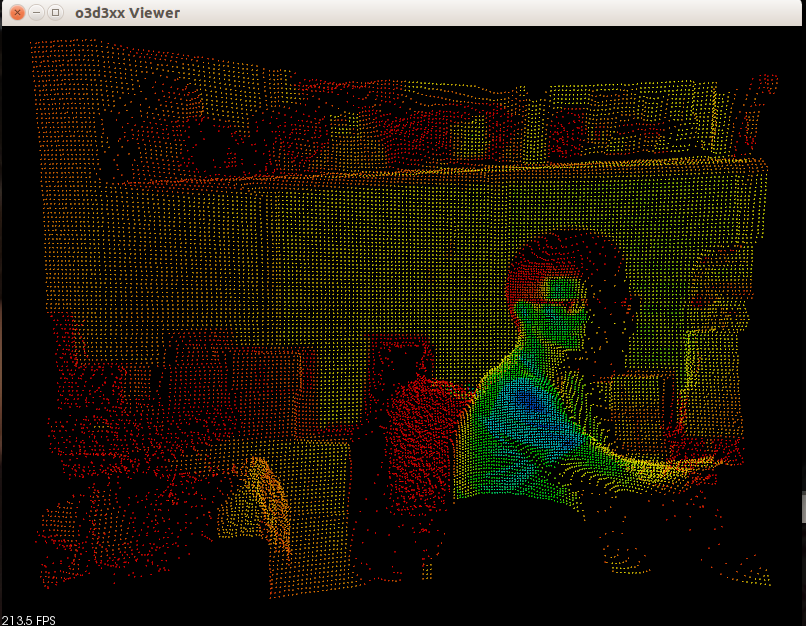

libo3d3xx
=========

Library and utilities for working with IFM Efector O3D3xx PMD-based ToF Cameras.

Software Compatibility Matrix
-----------------------------
<table>
  <tr>
    <th>libo3d3xx version</th>
    <th>IFM Firmware Version</th>
    <th>Supported Cameras</th>
    <th>Notes</th>
  </tr>
  <tr>
    <td>0.1.7</td>
    <td>0.06.13</td>
    <td>O3D303</td>
    <td>Initial Release</td>
  </tr>
  <tr>
    <td>0.1.8</td>
    <td>0.06.39</td>
    <td>O3D303</td>
    <td>DEPRECATED, USE 0.1.9</td>
  </tr>
  <tr>
    <td>0.1.9</td>
    <td>0.06.39</td>
    <td>O3D303</td>
    <td>Initial support for 100k pixel images</td>
  </tr>
  <tr>
    <td>0.1.10</td>
    <td>0.06.39</td>
    <td>O3D303</td>
    <td>DEPRECATED, USE 0.1.11</td>
  </tr>
  <tr>
    <td>0.1.11</td>
    <td>0.06.39</td>
    <td>O3D303</td>
    <td>Adds the XYZ OpenCV image</td>
  </tr>
  <tr>
    <td>0.2.0</td>
    <td>1.1.288</td>
    <td>O3D303</td>
    <td>Cross-compilation support and exposing raw amplitude image</td>
  </tr>
  <tr>
    <td>0.3.0</td>
    <td>1.3.1001</td>
    <td>O3D303</td>
    <td>
    100k pixel support, pluggable pcic schemas, exposing extrinsics and unit
    vectors, installing to /usr, and more.
    </td>
  </tr>
  <tr>
    <td>0.4.0</td>
    <td>1.3.1001</td>
    <td>O3D303</td>
    <td>
    Split up of the library into 3 modules: camera, framegrabber, image.
    </td>
  </tr>
</table>

Features
--------

High-level features of this library include:

* The code is written in modern C++11.
* The library is modular, allowing developers to use only the parts they need
  without incurring the overhead of unnecessary dependencies.
* The `image` module of the library employs PCL and OpenCV native image formats
  for users who wish to immediately take advantage of the time-tested
  algorithms from these widely popular open-source packages.
* Easily scriptable command line utilities are provided for performing common
  tasks associated with configuring, backing up, restoring, and introspecting,
  the camera settings. This scriptability lends itself to managing fleets of
  cameras for large-scale installations.
* A simple viewer application is provided (as part of the `image` module) for
  concurrently inspecting the point cloud, depth, amplitude, and confidence images.
* A business-friendly (Apache 2.0) License is employed.
* The code is being actively developed and maintained at
  [Love Park Robotics](http://loveparkrobotics.com). Pull requests are welcome
  from those who wish to contribute code!

[ROS](http://ros.org) bindings are available [here](https://github.com/lovepark/o3d3xx-ros)

Prerequisites
-------------

### Camera Module

Implements the XML-RPC protocol employed by the O3D3xx cameras and provides a
set of command-line utilities for configuring and managing the camera or fleet
of cameras.

* [Boost](http://www.boost.org) (>= 1.54)
* [Gtest](https://github.com/google/googletest) (unit testing)
* [Glog](https://github.com/google/glog) (logging infrastructure)
* [libxmlrpc](http://xmlrpc-c.sourceforge.net/)
* [CMake](http://www.cmake.org) (>= 2.8.12)

### Framegrabber Module

Implements a framegrabber for acquiring image data from the
O3D3xx. Additionally, this module defines a `ByteBuffer` interface allowing
developers to bridge the image data from the camera to their favorite
image and point cloud data structures.

* libo3d3xx_camera (part of this project)

### Image Module

Bridges the O3D3xx to OpenCV and PCL utilizing the `framegrabber` module's
`ByteBuffer` interface.

* libo3d3xx_camera (part of this project)
* libo3d3xx_framegrabber (part of this project)
* [OpenCV](http://opencv.org) (>= 2.4)
* [PCL](http://pointclouds.org) (>= 1.7.1)

Additionally, your compiler must support C++11. We are using g++ 4.8.x on
Ubuntu Linux 14.04 LTS.

Installation (from source)
--------------------------

(Assumes Linux)

### Quick Start

If you want to build, test, and install all three modules (`camera`,
`framegrabber`, and `image`) and you want to accept the default build options,
these are the directions you want to follow.

Assuming you are starting from the top-level directory of this source
distribution:

    $ mkdir build
    $ cd build
    $ make

That is it, you are done! Please don't walk away from your computer while the
code is building. To install the packages, we need `root` access, so, a `sudo`
is issued and will prompt you for your password.

**NOTE:** This automated build runs `make check` to run the unit tests. It
assumes that the hardware is available and running with factory default
settings. If your camera is using an IP address different from the factory
default of `192.168.0.69`, you can set the `O3D3XX_IP` environment variable to
point to the proper IP. Please note, the unit tests will wipe out your current
camera settings and applications. You should back up your camera prior to
running the unit tests.

### Full Instructions

If you need finer-grained control over the build of the individual modules or
you want to selectively build a module, or you are cross-compiling, etc., these
are the instructions for you.

**NOTE:** The `dpkg` commands issued in support of the installation(s) are here
  as an example. The particular version and architecture may differ on your
  computer.

#### Building the camera module

Assuming you are starting from the top-level directory of this source
distribution:

    $ cd modules/camera
    $ mkdir build
    $ cd build
    $ cmake ..
    $ make
    $ make check
    $ make package
    $ sudo dpkg -i libo3d3xx-camera_0.4.0_amd64.deb

If you are not on Debian or Ubuntu, you can substitute the `make package` and
`dpkg ...` commands with `make install`.

#### Building the framegrabber module

*(You must ensure that you have already installed the camera module prior to
 building and installing the framegrabber module.)*

Assuming you are starting from the top-level directory of this source
distribution:

    $ cd modules/framegrabber
    $ mkdir build
    $ cd build
    $ cmake ..
    $ make
    $ make check
    $ make package
    $ sudo dpkg -i libo3d3xx-framegrabber_0.4.0_amd64.deb

If you are not on Debian or Ubuntu, you can substitute the `make package` and
`dpkg ...` commands with `make install`.

#### Building the image module

*(You must ensure that you have already installed the camera and framegrabber
 modules prior to building and installing the image module.)*

Assuming you are starting from the top-level directory of this source
distribution:

    $ cd modules/image
    $ mkdir build
    $ cd build
    $ cmake ..
    $ make
    $ make check
    $ make package
    $ sudo dpkg -i libo3d3xx-image_0.4.0_amd64.deb

If you are not on Debian or Ubuntu, you can substitute the `make package` and
`dpkg ...` commands with `make install`.

#### Customizing the builds

If you are building the modules individually, you can further customize the
build by supplying `-D...` options on the `cmake` command line. To see what is
available to you, please look at the individual module's top-level
`CMakeLists.txt` file. For example, this snippet is from the `camera` module:

    # These `set` commands need to be manaully changed by editing the file
    set(CMAKE_INSTALL_PREFIX /usr)
    set(CMAKE_BUILD_TYPE Release) # Release or Debug

    # These can be set with -D... on the command line
    option(BUILD_TESTS "Build unit tests" ON)
    option(BUILD_SHARED_LIBS "Build shared libraries" ON)
    option(BUILD_STATIC_LIBS "Build static libraries" ON)
    option(BUILD_EXE_VERSION "Build o3d3xx-version" ON)
    option(BUILD_EXE_RESET "Build o3d3xx-reset" ON)
    option(BUILD_EXE_LS "Build o3d3xx-ls" ON)
    option(BUILD_EXE_DUMP "Build o3d3xx-dump" ON)
    option(BUILD_EXE_CONFIG "Build o3d3xx-config" ON)
    option(BUILD_EXE_RM "Build o3d3xx-rm" ON)
    option(BUILD_EXE_REBOOT "Build o3d3xx-reboot" ON)
    option(BUILD_EXE_IMAGER_TYPES "Build o3d3xx-imager-types" ON)
    option(BUILD_EXE_IFM_IMPORT "Build o3d3xx-ifm-import" ON)
    option(BUILD_EXE_IFM_EXPORT "Build o3d3xx-ifm-export" ON)

    # These need to be manually changed by editing the file
    set(TARGET_IP "192.168.0.68")
    set(TARGET_USER "lovepark")
    set(TARGET_DIR "/home/lovepark/debs/")

So, for example, if you did not want to build and run the unit tests (bad idea,
BTW), you could:

    $ mkdir build
    $ cd build
    $ cmake -DBUILD_TESTS=OFF ..
    $ ... etc ...

#### Cross-compiling

Please see the [cross compiling](doc/cross_compiling.md) article.

Running
-------

* [Command-line utilities](doc/utils.md)
* Examples coming soon.

Known Issues, Bugs, and our TODO list
-------------------------------------

Please see the [Github Issues](https://github.com/lovepark/libo3d3xx/issues).

LICENSE
-------

Please see the file called [LICENSE](LICENSE).

AUTHORS
-------

Tom Panzarella <tom@loveparkrobotics.com>
