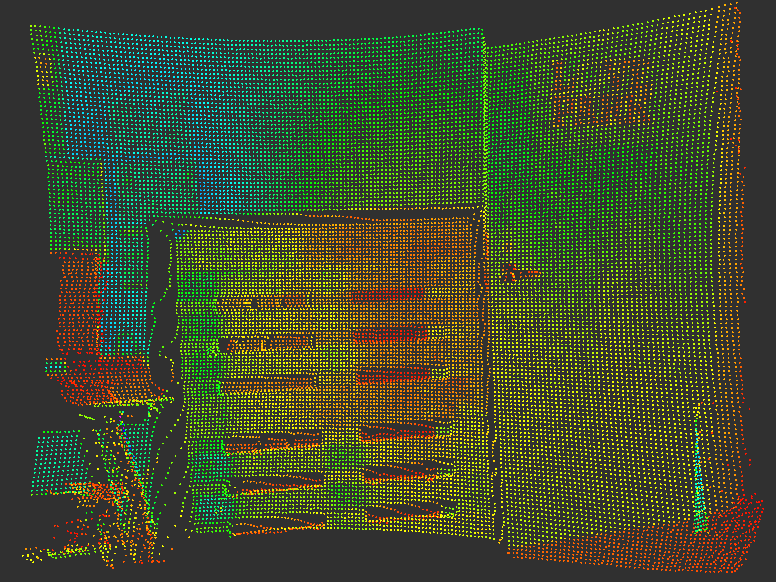
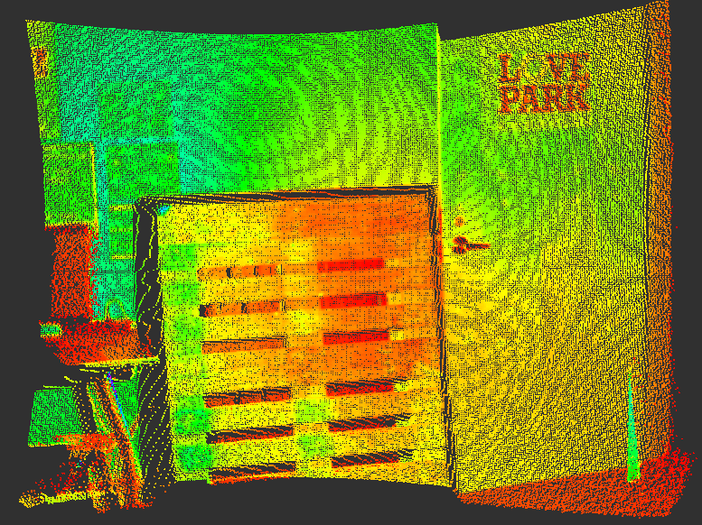

100k Pixels
===========

**UPDATE:** As of this writing (11/18/2015), this document is obsolete because
  the sensor and code now officially support the 100K imager. Simply turn it on
  by setting the `Output100K` parameter of the JSON serialization of the
  camera.

**NOTE:** As of this writing (8/17/15), running your O3D303 at 100k pixels is
  currently unsupported by the sensor vendor. Experiment with this modality at
  your own risk.

The 0.06.39 version of the IFM firmware for the O3D303 introduced the
capability to acquire images at (approximately) 100k pixels. Specifically, the
images are 264 x 352 vs. the standard 132 x 176. More is not always better but
none-the-less it is nice to have options and we want to support this 100k pixel
capability. Once the 100k pixel configuration is officially supported by IFM,
you will be able to turn on/off this capability through our standard JSON
configuration using the `o3d3xx-config` tool. We expect this to be a boolean
switch on the imager configuration called `Output100K`. However, as it stands
today, you have to sort of *backdoor* your way into unlocking this
feature. This document explains how to do it.

First, lets look at a comparision of the two resolutions by looking at a point
cloud snapshot taken in my office.

Here is the standard 132 x 176 point cloud:

Here is the same scene at 264 x 352:

If the above step up in resolution motivates you to investigate this feature
further, read-on for step-by-step instructions to enable it.

First, as a prerequisite, you need to be sure your camera is running
(at least) the 0.06.39 version of the IFM firmware. You can check that with:

    $ o3d3xx-dump | grep -i 'ifm_software'
        "IFM_Software": "0.06.39",

If your output does not look like the above, you should use IFM's Vision
Assistant to update the firmware on your camera. You can get the proper
firmware from our [firmware](../firmware/) directory. Be sure to check the
[checksum](../firmware/checksums.md5) before flashing your sensor.

Now, assuming your firmware is up to date, next, you need to create a new
application with the 100k pixel feature enabled. To do this you can use the
following:

    $ o3d3xx-ifm-import -f 100k.o3d3xxapp -a

The `100k.o3d3xxapp` file is provided with our source distribution in the
`test/data` directory. The `-a` flag indicates that this is importing an
application and not a full camera configuration.

Next, you should list the applications on your camera to see that it is there:

    $ o3d3xx-ls
    * [1] id=1746030257, name=Sample Application, description=
      [2] id=476707713, name=100K Pixel Sample Application, description=

We can see the 100k application at index 2 as noted by the `o3d3xx-ls`
output. Now, we want to mark that as the active application:

    $ echo '{"o3d3xx":{"Device":{"ActiveApplication":"2"}}}' | o3d3xx-config

Now, check that the 100k application is active:

    $ o3d3xx-ls
      [1] id=1746030257, name=Sample Application, description=
    * [2] id=476707713, name=100K Pixel Sample Application, description=

At this point, you are good to go. You can further configure the application
using the standard `o3d3xx-dump` and `o3d3xx-config` tools. For example, the
images above were taken using the dual frequency dual exposure imager whereas
the default 100k application (as supplied) configures the imager for single
frequency dual exposure. The *correct* settings will be dictated by the
requirements of your application.
