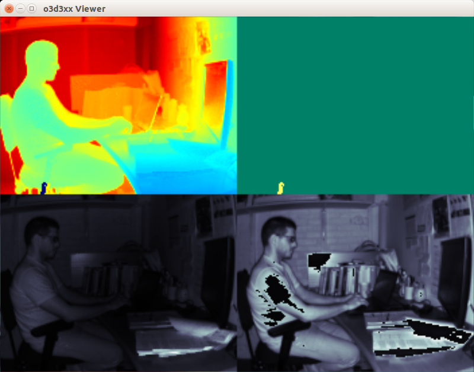

libo3d3xx Command Line Utilities
================================

The following command-line utilities are provided with `libo3d3xx`:

0. [o3d3xx-viewer](#o3d3xx-viewer)
1. [o3d3xx-config](#o3d3xx-config)
2. [o3d3xx-dump](#o3d3xx-dump)
3. [o3d3xx-ls](#o3d3xx-ls)
4. [o3d3xx-reboot](#o3d3xx-reboot)
5. [o3d3xx-reset](#o3d3xx-reset)
6. [o3d3xx-rm](#o3d3xx-rm)
7. [o3d3xx-version](#o3d3xx-version)
8. [o3d3xx-hz](#o3d3xx-hz)
9. [o3d3xx-ifm-import](#o3d3xx-ifm-import)
10. [o3d3xx-ifm-export](#o3d3xx-ifm-export)
11. [o3d3xx-schema](#o3d3xx-schema)

All of the command-line utilities accept the `--help` and the `--version`
flags. `--help` will list the arguments accepted by the program and `--version`
will display the version of `libo3d3xx` that the program is linked to.

A brief description of each program now follows:

o3d3xx-viewer
-------------

This program streams real-time image data from the camera and displays it on
the screen. To run the program:

	$ o3d3xx-viewer

This will open up two windows. The first window will display the point cloud:

Each point in the point cloud is colored by the associated pixel's amplitude
image value. The viewer window itself is a modified version of PCL's viewer
application, so, all the normal key commands will work, `q' will exit the
program. Additionally, 'A' will display a coordinate axes indicator on the
screen and 'a' will remove it.

The second window displays four images:

The top-left image is a rendering of the radial depth map. The top-right image
is an interpretation of the confidence image. In this binary image
rendering, "good" pixels are shown in green and "bad" pixels are shown in
yellow. The bottom-left image shows the normalized amplitude image and the
bottom-right is the raw amplitude image.

o3d3xx-config
-------------

This program is used to configure all of the camera settings including device,
network, application, and imager configuration. In addition, this program can
serve as a means to restore the camera from a backup
[JSON](http://www.json.org/) file that conforms to the file structure generated
by `o3d3xx-dump`.

To perform a full restore from a file, assuming you have the backup in
`/tmp/camera.json` you can run:

	$ o3d3xx-config < /tmp/camera.json

OR

	$ o3d3xx-config --file /tmp/camera.json

If you just want to mutate a single setting, for example changing the active
application to the application located at index 1, you can:

	$ echo '{"o3d3xx":{"Device":{"ActiveApplication":"1"}}}' | o3d3xx-config

The JSON syntax is available as an example in this [camera.json](./camera.json).

o3d3xx-dump
-----------

This program will dump the current camera configuration to JSON. The JSON is
written to stdout. To backup to a file, use your shell I/O redirection
facilities:

	$ o3d3xx-dump > camera.json

An example of the produced JSON is available in this
[camera.json](./camera.json).

o3d3xx-ls
---------

This program will list the applications currently installed on the camera and
provide an indication which application is currently active -- that is, the
application that would apply when running the `o3d3xx::FrameGrabber`. An
example of running this program and its output is show below:

	$ o3d3xx-ls
	* [1] id=964899043, name=Factory Default Test Application, description=

In this example, there is only one application on the camera and it is marked
as active. The number in square brackets indicates the application index.

o3d3xx-reboot
-------------

This program performs a soft boot of the camera. If you specify the `-r`
flag, this will request the sensor to reboot into _recovery_ mode. This will
allow you to do things like update the firmware (for example) by going to
`http://<sensor_ip>:8080/`.

o3d3xx-reset
------------

This program will return the camera to factory default settings.

o3d3xx-rm
---------

This program is used to remove an application from the camera. It takes the
application index as an argument. NOTE: to add applications you can use
`o3d3xx-config` (see above).

o3d3xx-version
--------------

This program displays the version of the library.

o3d3xx-hz
---------

This program can be used to measure the effective frame rate achieved by the
FrameGrabber based upon the imager config of the active application. The
program allows for configuring a number of frames to capture and a number of
runs to perform before computing the FPS statistics. See `--help` for details.

o3d3xx-ifm-import
-----------------

This program can be used to import IFM Vision Assistant files (e.g.,
applications) into the camera.

o3d3xx-ifm-export
-----------------

This program can be used to export data (e.g., applications) from the camera
into a format that is compatible with IFM Vision Assistant.

o3d3xx-schema
-------------

This program is used to inspect the PCIC schema the framegrabber will send to
the camera based on a specific mask. To see the default PCIC schema, you can
run the program with no arguments:

    $ o3d3xx-schema
    mask=15, str=-
    ---

      {
        "layouter": "flexible",
        "format"  : {"dataencoding":"ascii"},
        "elements":
         [
           {"type":"string", "value":"star", "id":"start_string"},
           {"type":"blob", "id":"distance_image"},
           {"type":"blob", "id":"normalized_amplitude_image"},
           {"type":"blob", "id":"amplitude_image"},
           {"type":"blob", "id":"x_image"},
           {"type":"blob", "id":"y_image"},
           {"type":"blob", "id":"z_image"},
           {"type":"blob", "id":"confidence_image"},
           {"type":"blob", "id":"extrinsic_calibration"},
           {"type":"string", "value":"stop", "id":"end_string"}
         ]
      }

You can see the schema that would be generated from a specific mask. For
example, if you specified a mask of `1`:

    $ o3d3xx-schema -m 1
    mask=1, str=-
    ---

      {
        "layouter": "flexible",
        "format"  : {"dataencoding":"ascii"},
        "elements":
         [
           {"type":"string", "value":"star", "id":"start_string"},
           {"type":"blob", "id":"distance_image"},
           {"type":"blob", "id":"confidence_image"},
           {"type":"blob", "id":"extrinsic_calibration"},
           {"type":"string", "value":"stop", "id":"end_string"}
         ]
      }

In the example above, we see that beyond the _invariants_ we will ask the
camera to only stream the distance image.

You can also construct schemas via symbolic constants. The constants that are
available to you can be viewed with:

    $ o3d3xx-schema -d
    Masking options:
	    IMG_RDIS: 1
	    IMG_AMP:  2
	    IMG_RAMP: 4
	    IMG_CART: 8
        IMG_UVEC: 16

So, to generate a schema (and its associated mask) you can:

    $ o3d3xx-schema -s "IMG_RDIS|IMG_AMP"
    mask=3, str=IMG_RDIS|IMG_AMP
    ---

      {
        "layouter": "flexible",
        "format"  : {"dataencoding":"ascii"},
        "elements":
         [
           {"type":"string", "value":"star", "id":"start_string"},
           {"type":"blob", "id":"distance_image"},
           {"type":"blob", "id":"normalized_amplitude_image"},
           {"type":"blob", "id":"confidence_image"},
           {"type":"blob", "id":"extrinsic_calibration"},
           {"type":"string", "value":"stop", "id":"end_string"}
         ]
      }

This shows that if this is the schema you wanted the camera to stream back, you
can pass a mask of `3` to the `o3d3xx::FrameGrabber` ctor. Of course, in your
code, you will use the defined constants (e.g., `o3d3xx::IMG_RDIS`) and `or`
them together to build up the desired schema.
